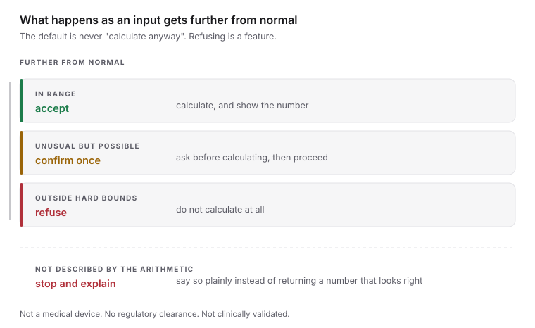

I built MealUnits for a family member. That is all the detail you are getting, and the reason why is most of what this post is about.

The app is small. You enter a blood sugar reading and the grams of carbohydrate you are about to eat, and it returns a number of units of short-acting insulin.[^1] The three settings it needs, a target, an insulin sensitivity factor and a carbohydrate ratio, come from the user's own prescriber and ship empty. No server behind it, no account in front of it. I have written loading spinners with more code.

## The default I deleted

For a while the app carried one person's prescription pre-filled, because I knew exactly who the user was. Then the audience became anyone with a phone, and the numbers had to go. A prefilled 150 is a prescription wearing the clothes of a default. For the original user, prefilling was a convenience. For a stranger installing the app, that field is not a stale default. It is someone else's prescription, sitting where theirs should be.

So the fields ship empty, and the app is worse for exactly one person so it can be safe for everyone else.

## Offline is the premise

Someone working out a dose before dinner cannot be told to wait for a network. So it is a PWA with a hand-written service worker. The convenient claim is that cache-first is fifteen lines of code. It is, until an install half-finishes and a half-cached version passes itself off as whole, or HTML from a new version loads assets from an old one, or a request hangs forever on a train. `src/sw.ts` grew opinions about all of that, none of them fun.

No server costs what you would expect: no sync, no backup, no signing in on a new phone. The mitigation is an export file the user keeps themselves.[^2] None of it is free. I just chose who pays.

## Two places the obvious code was wrong

The calculation is one sentence: a correction worked out from the reading, plus a meal amount from the carbohydrate grams. I am not writing it as a formula; on a public page it starts to look like an instruction.

Rounding came first. The obvious move is to round each part and then add them, which gives a different answer than adding first and rounding once. Nothing here is rounded until the end.

Clamping is the one that frightened me. One of the two parts can legitimately be negative, and flooring it at zero looks like harmless defensive coding. It is not. It produces a larger number than the arithmetic supports, which is exactly the direction an accidental bias must never point. Only the final total is clamped.

## The posture

> A wrong number here is a hypoglycaemic event, not a bug report.

That line is from the docs. So, stated flatly: MealUnits is not a medical device. It has no regulatory clearance and has not been clinically validated or reviewed by anyone. It does not diagnose or adjust anyone's therapy, and it decides nothing a clinician has not already decided. It is arithmetic on three numbers a prescriber gave you.

In the product, it looks like this:



| What the app sees | What it does | Why |
| --- | --- | --- |
| An input outside hard bounds | Refuses it | Impossible values are not negotiable |
| A value unusual but possible | Asks once to confirm | A pause, not a wall |
| A dose above a threshold from the user's own ratios | Requires confirmation | Large is relative to the prescription |
| A recent dose that may still be acting | Holds the correction back | The arithmetic cannot see insulin still working |
| A low reading | Treats it as a low to eat for | The arithmetic has no answer here, so the app does not offer one |
| An insulin type the arithmetic does not describe | Says so and stops | A plausible wrong number is the worst output |

There is also a disclaimer gate on first run. And one rule stands alone, which is a rule about this program rather than about insulin: having no model of how insulin decays, it cannot justify a shorter stacking window, so it does not offer one. The bolus-calculator literature names the too-short window as the hazard, because a short window hides insulin that is still working. Most of that literature is written for pumps. This is not a pump, which is the reason the app assumes the full window rather than reasoning its way to a shorter one.

## The check that could not fail

Most of the work was being willing to be wrong on the record. Every clinical decision has a document with its source and its reversals. A pre-meal timing shipped wrong twice. A regional claim about insulin concentrations did not survive checking. Both corrections sit in `docs/CLINICAL.md`, next to the mistakes.

`check-plan.py` reads `docs/PLAN.md` and `docs/CLINICAL.md` against the actual code. Then it turns on itself: `--self-test` corrupts each file in memory and re-runs every check, to prove each one can still fail.

```python
# check-plan.py --self-test
# Each seed edits one file in memory, then runs the whole checker against
# the mutated corpus. If the checker still returns clean, that check is
# decoration and the seed is reported as ESCAPED.
for label, rel, mutate in SELF_TESTS:
    mutated = mutate(base[rel])
    if mutated == base[rel]:
        # The anchor this seed edits has moved, so it verifies nothing.
        # Silently passing here is the failure mode the whole file exists for.
        escaped.append((label, "mutation changed nothing"))
    elif run({rel: mutated}) == 0:
        escaped.append((label, "checker did not notice"))
```

That second layer earned its keep, and keeps earning it. It found checks that had never once been capable of failing, and it is still finding them. They had been green since the day they were written, for the wrong reason: a mis-parsed key, an unreachable condition. I trusted them completely, which was the problem.

A check that cannot fail is indistinguishable from a check that passes, and running it again will not tell you which one you have.

[^1]: The name is literally the question: how many units for this meal? Units being how insulin is measured and injected.

[^2]: The export is a plain file in the user's own hands, which makes the user the backup strategy. For an app whose pitch is that nothing leaves the device, I think that is honest.
